# Kiran Desktop Environment

## 1. Overview

Kiran desktop environment is a stable, efficient, and easy-to-use desktop environment oriented towards user and market requirements. It consists of the desktop, taskbar, tray, control center, and window management components. This document describes how to use the Kiran desktop.

## 2. Desktop

### 2.1. Login Screen

After the installation is complete, restart the system. After the system is started, enter the user name and password to log in to the system. The login screen displays the time, date, power button, and soft keyboard button. The adaptive UI supports screen zooming and multi-screen display. The login dialog box can be switched between screens following the mouse pointer.

### 2.2. Main Screen

Enter the correct user name and password to log in to the system. The main screen is displayed, as shown in the following figure:

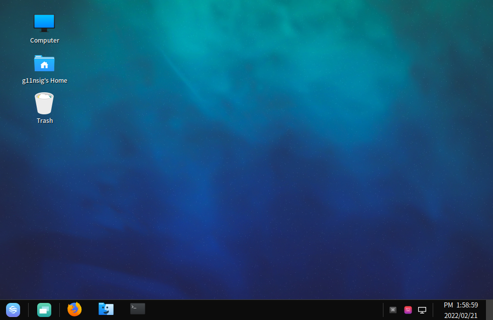

Several icons are displayed on the desktop, such as **Computer**, **Home** folder, and **Trash**. The panel, located at the bottom of the screen, allows you to launch applications and switch between virtual desktops.
A desktop is a working area of a user. You will perform operations and run applications on the desktop. You can place the files and applications on the desktop for easy access. Double-click the icons to run the corresponding applications or open the files. You can drag, add, or delete desktop icons. Desktop icons allow you to complete your work more conveniently.

 **Computer**: Double-click to display all the local and remote disks and folders accessed from this computer.

 **Home** folder: Double-click to display the contents in the home directory of the current user.

 **Trash**: Deleted files are temporarily stored in Trash.

Shortcut menu: Right-click on the desktop to display the shortcut menu, which provides shortcuts for icon management, folder creation, document creation, desktop background settings, and theme settings.

**Create Folder**: Creates a folder.

**Create Launcher...**: Creates a launcher.

**Create Document**: Creates an empty plain-text file.

**Open Terminal...**: Opens the terminal application.

**Organize Desktop by Name**: Sorts desktop files by name.

**Keep Aligned**: If this option is selected, the desktop icons are aligned to the grid.

**Change Desktop Background**: Opens Background to change the background picture of the desktop or lock screen.

### 2.3 Panel

The panel is usually located at the bottom of the screen and includes the start menu button, quick launch area, icons of frequently used applications and desktop applets, and taskbar that displays the currently running application.
When you hover the mouse pointer over an icon for several seconds, a white dialog box is displayed, describing the function of the icon.

## 3. Taskbar

Taskbar: displays running applications or opened documents. You can click an item on the taskbar to maximize or minimize the selected application window. You can right-click an item and choose Maximize, Minimize, or Close the application window from the shortcut menu.

| Component                                               | Description                                                                                                         |
| :------------------------------------------------------ | :------------------------------------------------------------------------------------------------------------------ |
|              | Start Menu button: Similar to the Start button in Windows. When you click it, the cascaded start menu is displayed. |
|        | Click to display the workspaces.                                                                                    |
|     | Click to start the file browser to view and manage files.                                                           |
|       | Click to start the terminal.                                                                                        |
|    | Click to start the Firefox browser.                                                                                 |
|  | Displays the current network status. Click to modify the network configuration.                                     |
|          | Displays the current date and time. You can customize the display style as required.                                |

## 4. Control Center

### 4.1. Start Menu Settings

Choose **Start Menu** > **Control Center** > **Start Menu** Settings.
You can set the display mode and opacity of the start menu, as shown in the following figure:

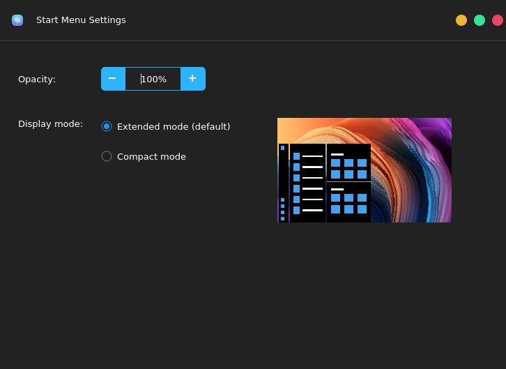

The appearance start menu changes based on the opacity and display mode, as shown in the following figure:

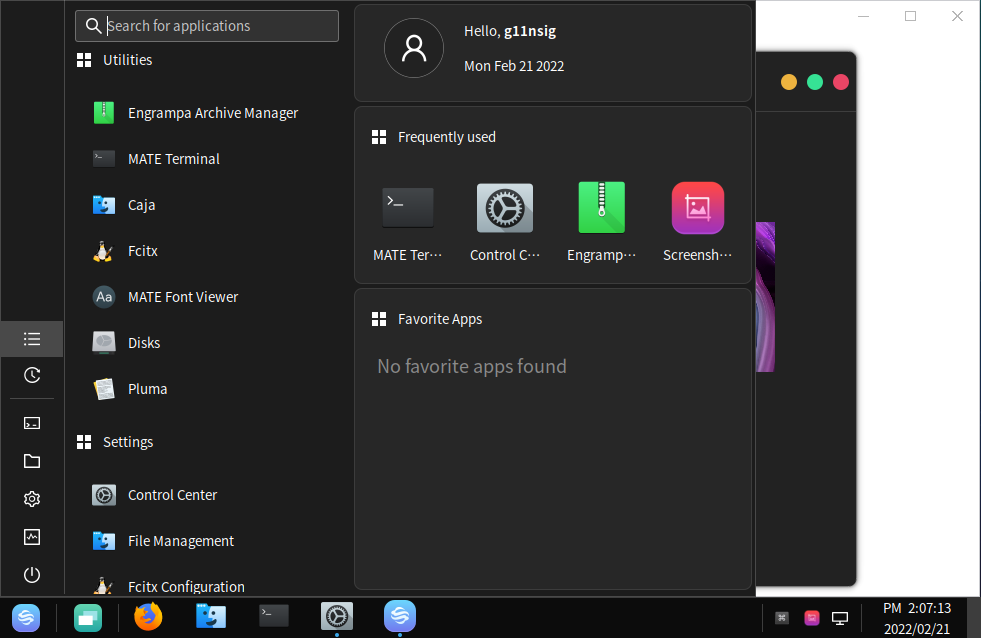

### 4.2. Greeter Settings

Choose **Start Menu** > **Control Center** > **Greeter Settings**.
In the Kiran desktop, you can set the login screen appearance by choosing **Greeter Settings** in **Control Center**, including the background image of the login screen, whether to enable automatic login, zoom ratio, whether to allow login by entering the user name, and whether to display the user list, as shown in the following figure:

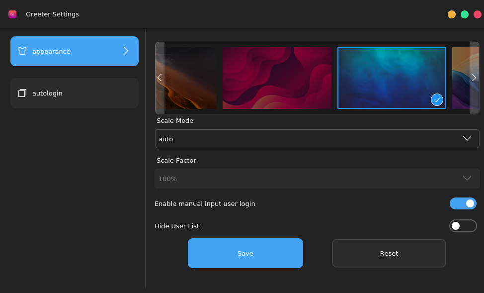

You can also set automatic login. Set the user name and delay for automatic login. After the system is restarted, the user automatically logs in without entering the password.

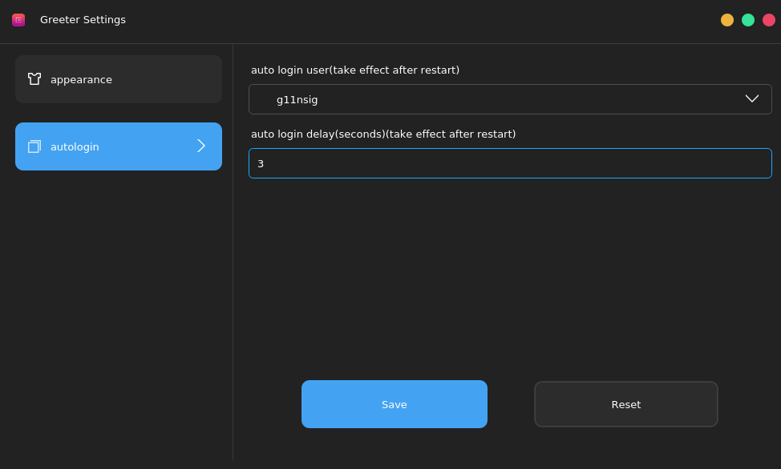

### 4.3 Display Settings

Display attribute customization is required for every desktop environment. The Kiran desktop provides a powerful tool for customizing display attributes. You can choose **Start Menu** > **Control Center** > **Display Settings** to open the **Display Settings** window, as shown in the following figure:

You can set the screen rotation, resolution, refresh rate, zoom rate, and flip. After the settings are complete, click **Apply**.

### 4.4 Mouse Settings

Configure the mouse by selecting **Kiran Cpanel Mouse** in **Control Center**. You can select left-hand or right-hand mode, adjust the mouse pointer speed, set whether to scroll naturally, and set whether to enable the middle button emulation by pressing the left and right button simultaneously. The following figure shows the normal mouse setting window:

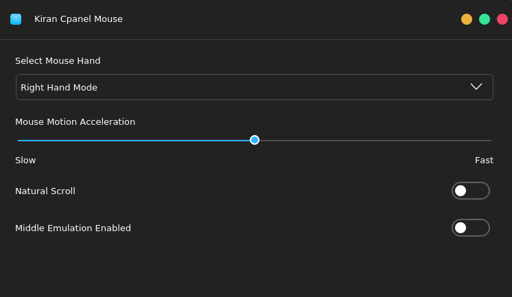

### 4.5. Account Manager

Account Manager is an easy-to-use tool for managing users and user groups. You can use this tool to:

1. Add users and set user attributes.
2. Modify user attributes.
3. View user attributes.
4. Delete users.

User attributes include the user name, password, and login shell. User group attribute indicates the users in the user group.

#### 4.5.1 Starting Account Manager

In **Control Center**, choose **Account Manager** to start the account management tool, as shown in the following figure:

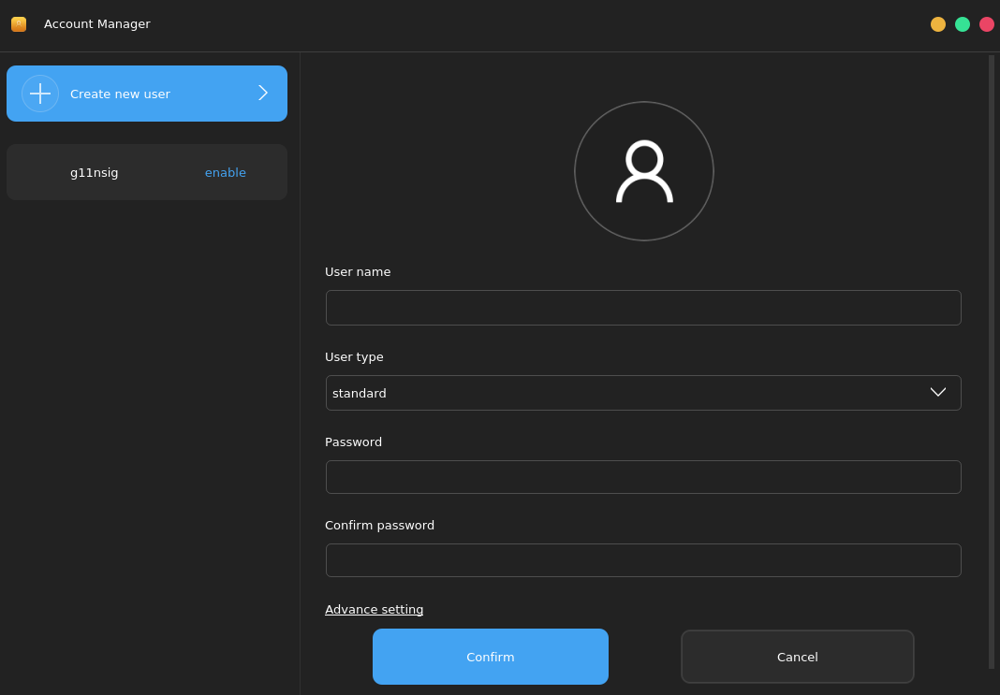

In the window, you can see the user list on the left and the detailed information on the right. Currently, all users in the system except the root user are listed. Click a user on the left. The detailed information about the user is displayed, including the user ID and user type.
Click **Create new user**. On the page that is displayed on the right, enter the user name, user type, and password, and change the avatar as required. After setting the attributes, click **Confirm**.

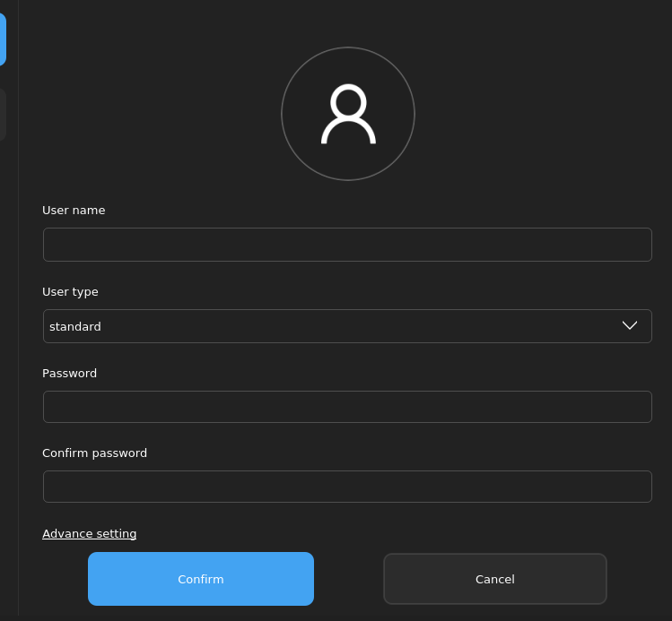

**Note**: If you have set the minimum length of a password (for example, four digits), you must enter a password of at least four digits. Otherwise, the system will not accept the password.

Click the avatar area to change the avatar. The system has built-in avatars for you to select. You can also add your own avatar and click Confirm to save the settings.

#### 4.5.2. Deleting a User

Click the user to be deleted in the left area and click **Delete** on the toolbar on the right, as shown in the following figures:

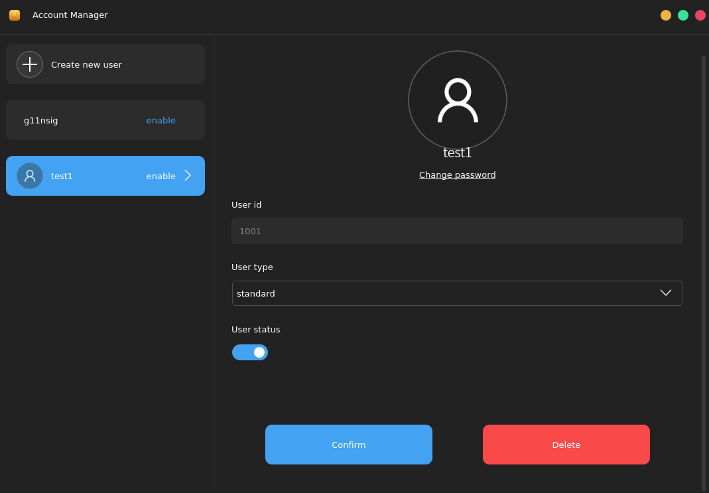

In the displayed dialog box, click **No** to cancel the deletion, or click **Yes** to confirm the deletion.

#### 4.5.3. Advanced Settings

Choose **Create new user**, enter the user name and password, and then choose **Advanced Settings**. In the displayed dialog box, set the login shell, user ID, and user home directory.

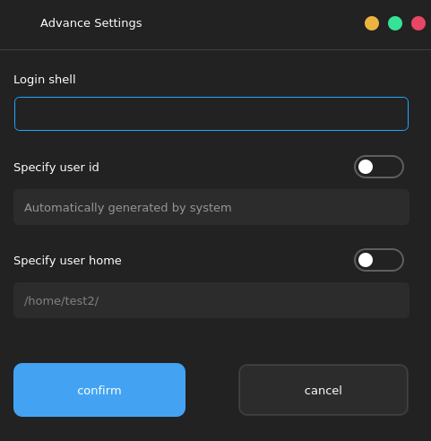

### 4.6. Appearance

Display attribute customization is required for every desktop environment. The Kiran desktop provides a powerful tool for customizing display attributes. Appearance is a tool that provides unified configuration and management for the desktop background, theme, and font of the system.
Choose **Start Menu** > **Control Center** > **Appearance**. The **Appearance** window is displayed, as shown in the following figure:

#### 4.6.1. Theme

Theme can be used to set the style of the dialog boxes, menus, system panels, and icons in a unified manner or separately according to your preference.

1. Theme Settings
   The system provides multiple themes by default. You can view the theme information in the **Theme** tab page. Click the theme in the **Theme** tab page to set the system theme, as shown in the following figure:

    

2. Customizing a Theme
   You can click Customize... to customize a theme based on your preferences, as shown in the following figure. Customization options include controls, color, window border, icons, and pointer.

    

#### 4.6.2. Background

You can set the desktop background, including the color and style.

1. Background image settings
   As shown in the following figure, click a wallpaper in the wallpaper area to set it as the desktop wallpaper.

    

2. Style
   You can choose how the wallpaper fits the screen by choosing a style from the drop-down list. The styles include tile, zoom, center, scale, stretch, and span.

3. Adding and removing wallpapers
   You can click **Add...** to add your own wallpaper, as shown in the following figure:

    

    Click **Open** to add the wallpaper.
    You can also click **Remove** to remove wallpapers that you do not like. Simply select a wallpaper and click **Remove**.

4. Desktop background color filling settings
   You can set a color as the background. In the wallpaper tab page, choose **No Desktop Background** to use a color as the background.
   The color filling styles include solid color, horizontal gradient, and vertical gradient.

    

#### 4.6.3. Font

1. Font Settings

You can set the fonts of the GUI of the system. The font styles include application, document, desktop, window title, and fixed width fonts.

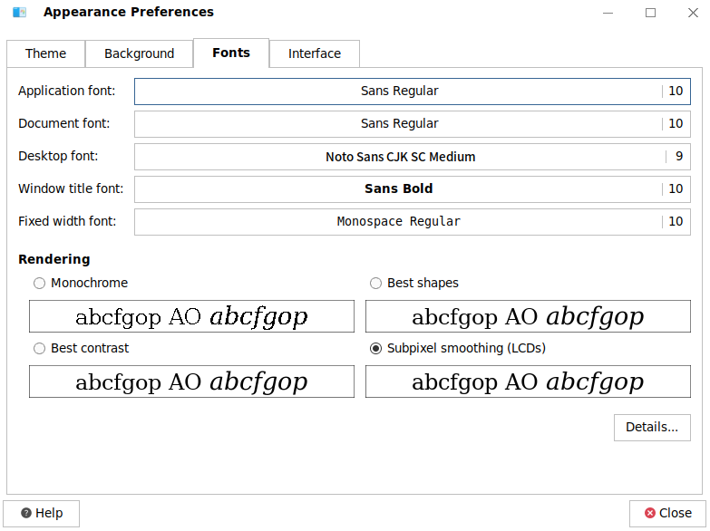

1. Font rendering and details settings

Font rendering settings: You can choose one of the following font rendering styles: monochrome, best shapes, best contrast, and subpixel smoothing.
By default, **best shapes** is used, as shown in the following figure:

1. Font Details Settings
   You can click **Details...** to set the font details. Details settings include resolution, smoothing, hinting, and subpixel order.

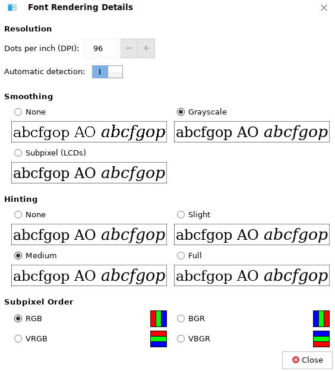

You can choose whether to display icons in menus and on buttons.

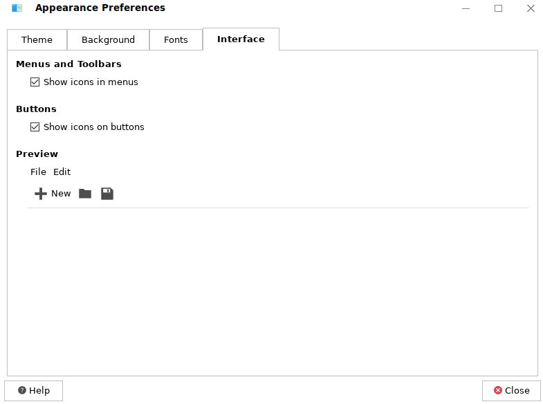

## 5. Desktop Applications

### 5.1. Text Editor

To launch the text editor, click **Start Menu**> **All applications** > **Utilities**> **Pluma**. You can also start the text editor by entering **pluma** in the shell prompt.
A text editor is one of the most commonly used tools in all computer systems. Whether to you are creating a plain text file, data file, or source program, you need to use an editor. The text editor is used to view and modify plain text files. Plain text files, such as system logs and configuration files, are common text files that do not contain fonts or style formats.

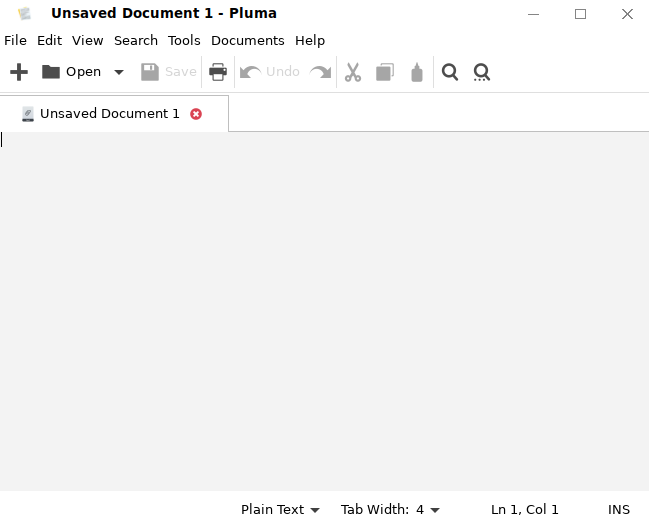

### 5.2. Terminal

In the desktop environment, you can use the Terminal application to enter the command line interface. To start Terminal, choose **Start Menu** > **All applications** > **Utilities** > **Terminal**, or click the icon on the desktop panel.

### 5.3. Firefox

To launch Firefox, click **Start Menu** > **All applications** > **Network** > **Firefox**.
Firefox is a free and open source web browser. It uses the Gecko rendering engine and supports multiple operating systems, such as Windows, Mac OS X, and GNU/Linux. Firefox is small in size, fast in speed, and has other advanced features, such as tabbed browsing, faster loading speed, pop-up blocker, customizable toolbar, extension management, better search features, and a convenient sidebar.

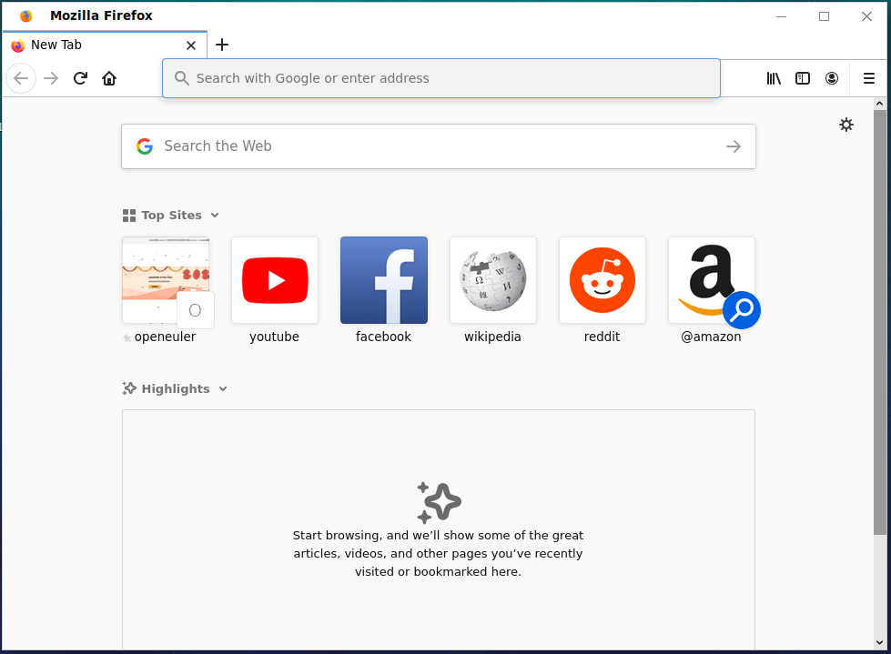

### 5.4 Screenshot Tool

Choose **Start Menu** > **All applications** > **Graphics** > **Screenshot tool** to start the screenshot tool.
Screenshot tool is a small and flexible screenshot software of the Kiran desktop. The operation UI is simple and easy to use. When the software is started, the icon of the screenshot tool is added to the tray.

Click the icon to display the screenshot interface. You can select the screenshot area. You can right-click the icon and choose Open Launcher to set the capture area and delay.

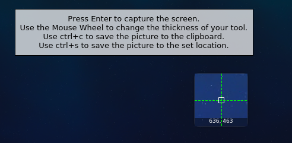

In the displayed dialog box, click **√** to save the file to the desktop, or choose Options and select a custom save location, as shown in the following figure:

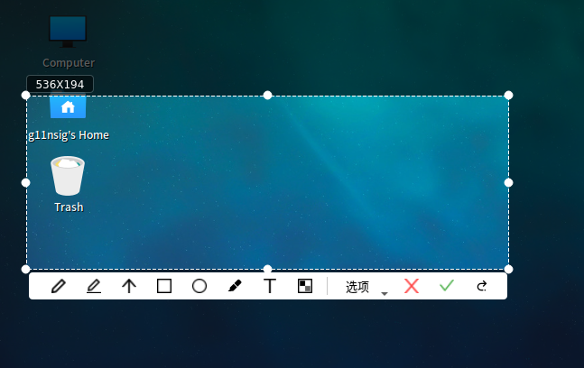

### 5.5 Network Settings

The Kiran desktop uses NetworkManager as the network configuration tool. NetworkManager can set, configure, and manage various network types, and provides advanced support for mobile broadband devices, Bluetooth, and IPv6 protocol. Choose Start Menu > **Control Center** > **Advanced Network Configuration**, or right-click the network icon in the lower right corner of the desktop and choose **Edit Connections...**, as shown in the following figure:

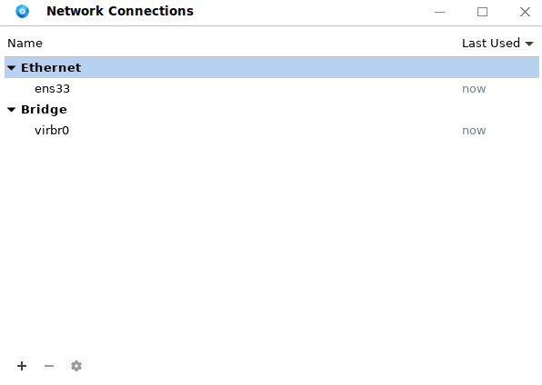

Wired connection settings:
Select the current NIC. For example, **ens33** is the NIC of the current system. Select the NIC and click the edit button. The NIC editing dialog box is displayed:

IPv4 Settings are frequently used. In this example, DHCP is selected to obtain the IP address and DNS server. The system automatically obtains an IP address for the user.
When you need to manually enter the IP address, select **Manual** from the **Method** drop-down list, as shown in the following figure:

Click **Add**, enter the IP address, subnet mask, gateway, and DNS server, as shown in the following figure:

Enter the IP address, subnet mask, gateway, and DNS, and Click **Save**. Click the network icon in the lower right corner of the desktop, choose **Disconnect** to disconnect from the network, and then reconnect to the network.

---

### 5.6. Time and Date Manager

To set the date and time, select **Time And Date Manager** in **Control Center**, or click the date area in the lower right corner of the desktop. The following window is displayed:

Automatic synchronization: Enable **Automatic synchronization** and connect to the Internet to automatically synchronize the date and time.
Time zone settings: Click **Change Time Zone**, select a time zone from the list on the right, and then click **Save**.

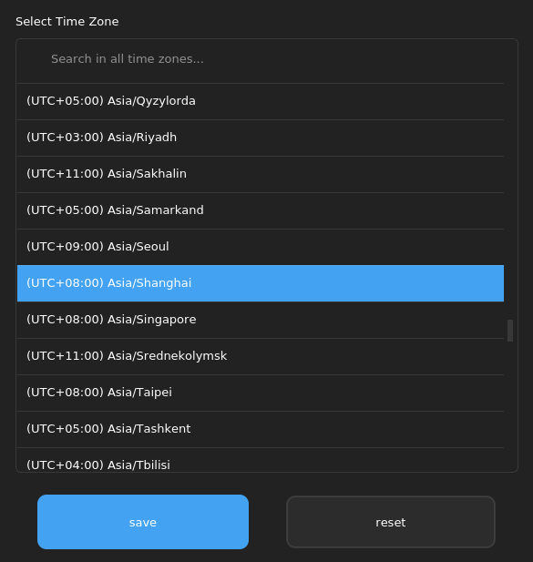

Manually set the time: Disable **Automatic synchronization** and click **Set Time Manually** to manually set the year, month, day, and time. After the modification is complete, click **Save**.

Modifying the date format: Click **Time date format setting** to modify the date format. You can set the long and short date display formats, time format, and whether to display seconds.

